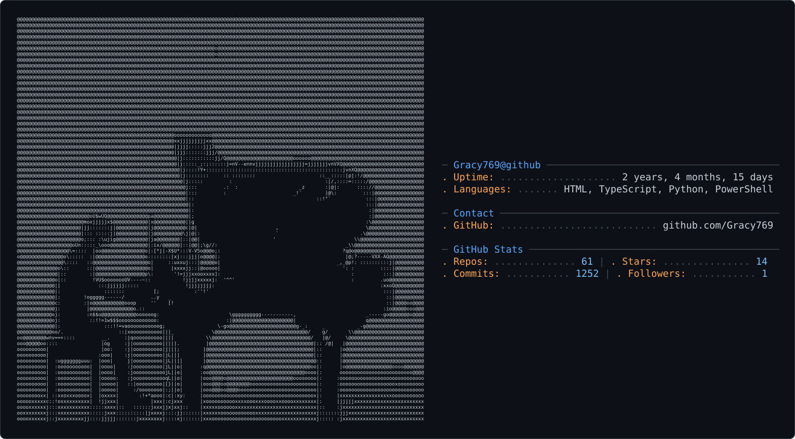

<div align="center">

<picture>
  <source media="(prefers-color-scheme: dark)" srcset="dark_mode.svg" />
  <source media="(prefers-color-scheme: light)" srcset="light_mode.svg" />
  
</picture>

</div>

### `whoami`

Engineering student (electronics + control systems) who spends the rest of the time
fine-tuning language models on a laptop that was never meant for this, and building
games in the gaps between. No vibe coding, no fluff — just things that either work
or get rebuilt until they do.

```
> current_focus     : LLM fine-tuning, local inference optimization, indie game dev
> constraint         : RTX 4050, 6GB VRAM — everything gets squeezed
> publishing_as      : HuggingFace @ SamY36
> status             : building, breaking, rebuilding
```

---

### Shipping

**Local inference on hard mode**
Built a custom `llama.cpp` fork with CUDA support from source in WSL2 to get real
GPU inference out of a 27B model quantized down to Q1_0 on 6GB of VRAM. Benchmarked
it across coding, math, and logic. Hallucinations turned out to be fixable with
live web search instead of blaming the weights — wrote a custom anti-hallucination
system prompt to prove it.

**Fine-tuned models — [HuggingFace @ SamY36](https://huggingface.co/SamY36)**
Multiple LoRA fine-tunes across coding, cybersecurity, and web dev, trained on
Kaggle's free compute. Q8_0 GGUF exports so they're actually runnable, not just
benchmark trophies.

**Bloombound**
A fungal-themed, Hollow Knight-inspired metroidvania. Full GDD, HTML5/Canvas
prototype with sword combat, a materials/crafting system, and a "Blade Art"
mechanic system.

**Soulslike (Godot 4.x)**
3D action game with Sekiro-style posture/deflect combat, spear and sword
progression, and AI-assisted 3D asset pipelines for bosses and enemies.

---

### Repos

**AI, LLMs & chatbots**
| Repo | Stack | What it is |
|---|---|---|
| [AI-Mood-track](https://github.com/Gracy769/AI-Mood-track) | TypeScript | AI-driven mood tracking frontend |
| [Chatbot](https://github.com/Gracy769/Chatbot) | HTML | Web-based chatbot client |
| [AI](https://github.com/Gracy769/AI) · [AI1](https://github.com/Gracy769/AI1) · [LLM](https://github.com/Gracy769/LLM) | Python / HTML | AI & LLM testing scripts, learning templates |

**Tools & utilities**
| Repo | Stack | What it is |
|---|---|---|
| [ByClickPremium](https://github.com/Gracy769/ByClickPremium) | — | One-click YouTube downloader — up to 4K, playlists, channels, audio conversion |
| [UnlimiMail-Generator](https://github.com/Gracy769/UnlimiMail-Generator) | — | Disposable Gmail alias generator via plus-addressing/dot tricks |
| [Zerodha 2.0](https://github.com/Gracy769/Zerodha) | TypeScript | Zerodha trading clone |
| [Water-sync](https://github.com/Gracy769/Water-sync) | TypeScript | Sync utility script |

**Academic & core**
| Repo | Stack | What it is |
|---|---|---|
| [Compiler](https://github.com/Gracy769/Compiler) | Python | Compiler design coursework |
| [Hostel-Daa](https://github.com/Gracy769/Hostel-Daa) | Python | Hostel allocation / DAA coursework |

**Entertainment**
| Repo | Stack | What it is |
|---|---|---|
| [AniNeko](https://github.com/Gracy769/AniNeko) | — | Anime watch-list / catalog tracker |
| [Anime](https://github.com/Gracy769/Anime) · [Kawaii.anime](https://github.com/Gracy769/Kawaii.anime) | HTML | Anime review sites / landing pages |

---

### Stack

**AI / ML**

   

**Languages**

   

**Game Dev**

  

**Tools**

   

---

<div align="center">

### Contribution activity

<picture>
  <source media="(prefers-color-scheme: dark)" srcset="https://raw.githubusercontent.com/Gracy769/Gracy769/output/github-contribution-grid-snake-dark.svg" />
  <source media="(prefers-color-scheme: light)" srcset="https://raw.githubusercontent.com/Gracy769/Gracy769/output/github-contribution-grid-snake.svg" />
  
</picture>

</div>
